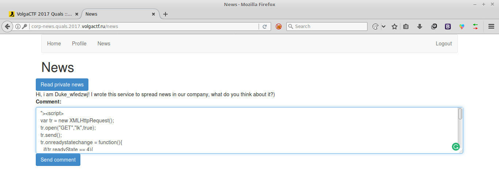
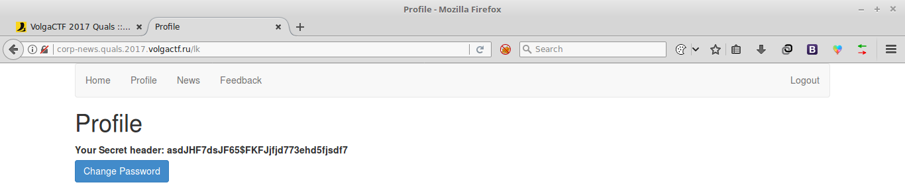
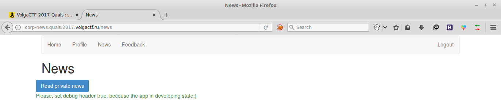
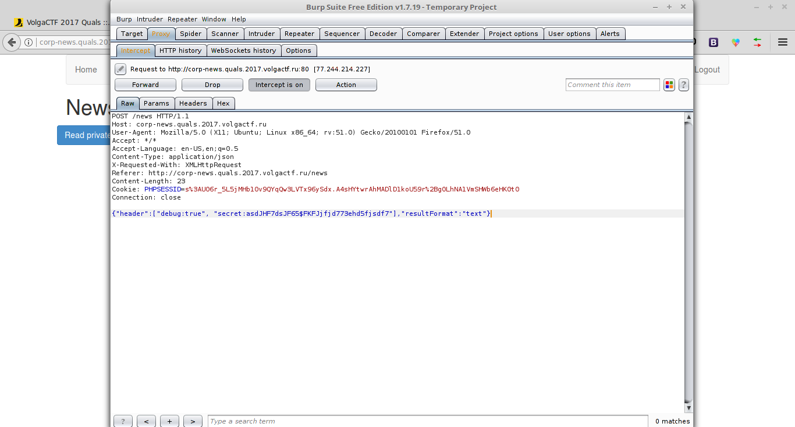
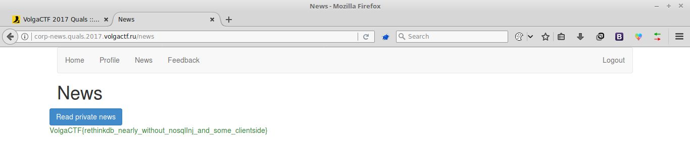

# Corp News
### Web 300pts

> **Corp News**
>
> We have created an excellent service for obtaining corporate news. You never know the secret information    
> [corp-news.quals.2017.volgactf.ru](http://corp-news.quals.2017.volgactf.ru/)

After login you can see there is an option to send comment.
So I figured out that  there should be XSS and I wrote a [script](files/xss) to
change the password of out contact, in my case `Duke_wfedzwj`.

And after sending the message, the password of our contact got changed to
Test1234. Then I logged to to contact's account using username `Duke_wfedzwj` and password
`Test1234`. There I could see a secret header `asdJHF7dsJF65$FKFJjfjd773ehd5fjsdf7`

In News tab, when I click on Read Private News, it shows     
`Please, set debug header true, becouse the app in developing state:)`

So I intersepted the request and modified the header to     
`{"header":["debug:true", "secret:asdJHF7dsJF65$FKFJjfjd773ehd5fjsdf7"],"resultFormat":"text"}`

And forwarding the request gives the flag.    
`VolgaCTF{rethinkdb_nearly_without_nosqlInj_and_some_clientside}`

